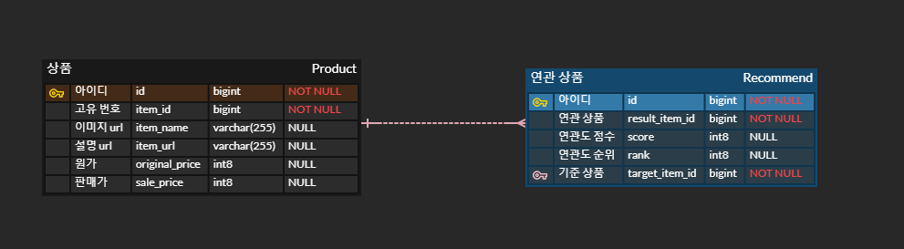
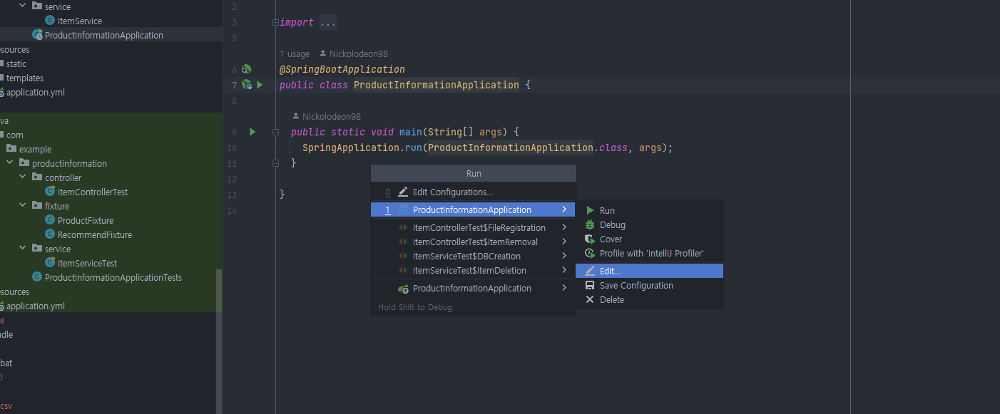
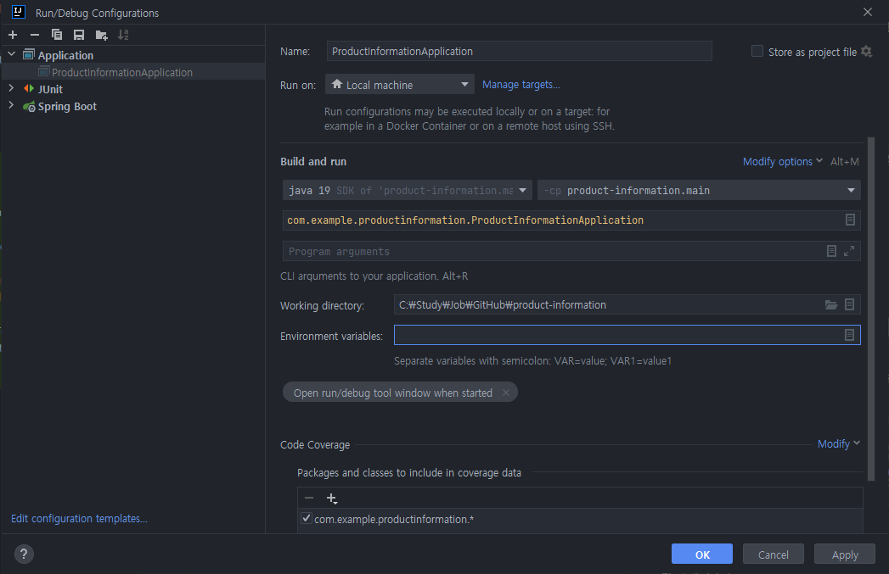
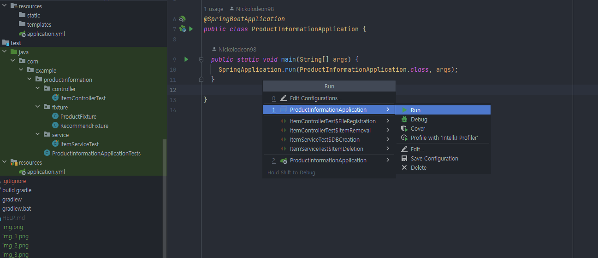
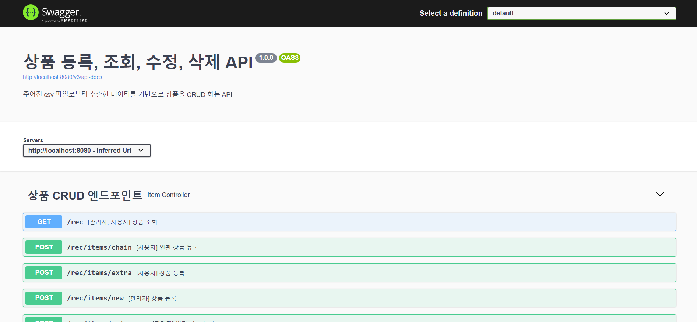

## 상품 및 연관 상품 CRUD API (성명: 전승환)
<hr>

### 프로젝트 소개
<hr>
product.csv, rec.csv 두 파일을 활용해 상품 정보를 생성, 조회, 수정, 삭제할 수 있는 API 구현 프로젝트

### ERD
<hr>



### 개발 환경

- 자바: ``JAVA 11``
- 개발 툴: ``Spring Boot 2.7.15``
- 필수 라이브러리: ``SpringBoot Web``, ``MySQL``, ``Spring Data JPA``, ``Lombok``, ``Swagger``
- 빌드: ``Gradle 8.2.1``
- DB: ``MySQL``
- CLOUD: ``AWS EC2``

### Swagger API 실행 방법
<hr>

#### MySQL DB를 AWS EC2 서버에 올려 사용했습니다. 다음과 같이 설정 후 빌드하시면 됩니다.
1. 실행 환경변수를 설정하기 위해 아래의 화면에서 Edit에 들어갑니다. 


2. 아래와 같은 화면을 볼 수 있습니다. Environment variables 칸에 아래 문자열을 입력합니다:
```
SPRING_DATASOURCE_PASSWORD=Ingod2013!;SPRING_DATASOURCE_URL=jdbc:mysql://ec2-13-209-88-90.ap-northeast-2.compute.amazonaws.com:3306/techlabs-db;SPRING_DATASOURCE_USERNAME=root
```


3. run 을 클릭하여 실행합니다.


4. 실행이 되면 브라우저에 접속합니다.

5. 주소창에 다음을 입력합니다:
``http://localhost:8080/swagger-ui/``

6. 아래와 같은 화면을 볼 수 있습니다. 
